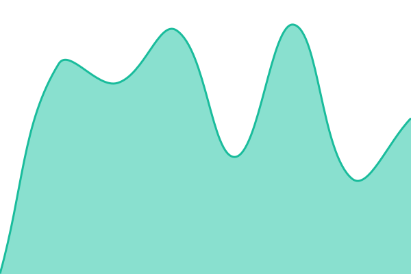

# [📈 Live Status](https://la-test.github.io/sbx1-upptime): <!--live status--> **🟨 Degraded performance**

This repository contains the open-source uptime monitor and status page for [la-test](https://la-test.github.io/sbx1-upptime), powered by [Upptime](https://github.com/upptime/upptime).

With [Upptime](https://upptime.js.org), you can get your own unlimited and free uptime monitor and status page, powered entirely by a GitHub repository. We use [Issues](https://github.com/la-test/sbx1-upptime/issues) as incident reports, [Actions](https://github.com/la-test/sbx1-upptime/actions) as uptime monitors, and [Pages](https://la-test.github.io/sbx1-upptime) for the status page.

<!--start: status pages-->
<!-- This summary is generated by Upptime (https://github.com/upptime/upptime) -->
<!-- Do not edit this manually, your changes will be overwritten -->
<!-- prettier-ignore -->
| URL | Status | History | Response Time | Uptime |
| --- | ------ | ------- | ------------- | ------ |
|  [Least Authority - website](https://leastauthority.com/) | 🟩 Up | [least-authority-website.yml](https://github.com/la-test/sbx1-upptime/commits/HEAD/history/least-authority-website.yml) | 

 1169ms
     
 | 

<a href="https://la-test.github.io/sbx1-upptime/history/least-authority-website">100.00%</a>
    

|  [Least Authority - redirect](http://leastauthority.com/) | 🟩 Up | [least-authority-redirect.yml](https://github.com/la-test/sbx1-upptime/commits/HEAD/history/least-authority-redirect.yml) | 

 1315ms
     
 | 

<a href="https://la-test.github.io/sbx1-upptime/history/least-authority-redirect">100.00%</a>
    

|  [Winden - website](https://winden.app/) | 🟩 Up | [winden-website.yml](https://github.com/la-test/sbx1-upptime/commits/HEAD/history/winden-website.yml) | 

 638ms
     
 | 

<a href="https://la-test.github.io/sbx1-upptime/history/winden-website">100.00%</a>
    

|  [Winden - redirect](http://winden.app/) | 🟩 Up | [winden-redirect.yml](https://github.com/la-test/sbx1-upptime/commits/HEAD/history/winden-redirect.yml) | 

 730ms
     
 | 

<a href="https://la-test.github.io/sbx1-upptime/history/winden-redirect">100.00%</a>
    

|  [Winden - it redirect](http://winden.it/) | 🟩 Up | [winden-it-redirect.yml](https://github.com/la-test/sbx1-upptime/commits/HEAD/history/winden-it-redirect.yml) | 

 1791ms
     
 | 

<a href="https://la-test.github.io/sbx1-upptime/history/winden-it-redirect">100.00%</a>
    

|  [Winden - me redirect](http://winden.me/) | 🟩 Up | [winden-me-redirect.yml](https://github.com/la-test/sbx1-upptime/commits/HEAD/history/winden-me-redirect.yml) | 

 1327ms
     
 | 

<a href="https://la-test.github.io/sbx1-upptime/history/winden-me-redirect">100.00%</a>
    

|  [Winden - tech redirect](http://winden.tech/) | 🟩 Up | [winden-tech-redirect.yml](https://github.com/la-test/sbx1-upptime/commits/HEAD/history/winden-tech-redirect.yml) | 

 1314ms
     
 | 

<a href="https://la-test.github.io/sbx1-upptime/history/winden-tech-redirect">100.00%</a>
    

|  [Private Storage - website](https://private.storage/) | 🟨 Degraded | [private-storage-website.yml](https://github.com/la-test/sbx1-upptime/commits/HEAD/history/private-storage-website.yml) | 

 431ms
     
 | 

<a href="https://la-test.github.io/sbx1-upptime/history/private-storage-website">0.00%</a>
    

|  [Private Storage - redirect](http://private.storage/) | 🟨 Degraded | [private-storage-redirect.yml](https://github.com/la-test/sbx1-upptime/commits/HEAD/history/private-storage-redirect.yml) | 

 456ms
     
 | 

<a href="https://la-test.github.io/sbx1-upptime/history/private-storage-redirect">0.00%</a>
    

|  [Private Storage - app redirect](http://privatestorage.app/) | 🟨 Degraded | [private-storage-app-redirect.yml](https://github.com/la-test/sbx1-upptime/commits/HEAD/history/private-storage-app-redirect.yml) | 

 532ms
     
 | 

<a href="https://la-test.github.io/sbx1-upptime/history/private-storage-app-redirect">0.00%</a>
    

|  [Private Storage - dev redirect](http://privatestorage.dev/) | 🟨 Degraded | [private-storage-dev-redirect.yml](https://github.com/la-test/sbx1-upptime/commits/HEAD/history/private-storage-dev-redirect.yml) | 

 455ms
     
 | 

<a href="https://la-test.github.io/sbx1-upptime/history/private-storage-dev-redirect">0.00%</a>
    

|  [Private Storage - io redirect](http://privatestorage.io/) | 🟨 Degraded | [private-storage-io-redirect.yml](https://github.com/la-test/sbx1-upptime/commits/HEAD/history/private-storage-io-redirect.yml) | 

 805ms
     
 | 

<a href="https://la-test.github.io/sbx1-upptime/history/private-storage-io-redirect">0.00%</a>
    

|  [Private Storage - online redirect](http://privatestorage.online/) | 🟨 Degraded | [private-storage-online-redirect.yml](https://github.com/la-test/sbx1-upptime/commits/HEAD/history/private-storage-online-redirect.yml) | 

 482ms
     
 | 

<a href="https://la-test.github.io/sbx1-upptime/history/private-storage-online-redirect">0.00%</a>
    

|  [Private Storage - org redirect](http://privatestorage.org/) | 🟨 Degraded | [private-storage-org-redirect.yml](https://github.com/la-test/sbx1-upptime/commits/HEAD/history/private-storage-org-redirect.yml) | 

 344ms
     
 | 

<a href="https://la-test.github.io/sbx1-upptime/history/private-storage-org-redirect">0.00%</a>
    

|  [Private Storage - tech redirect](http://privatestorage.tech/) | 🟨 Degraded | [private-storage-tech-redirect.yml](https://github.com/la-test/sbx1-upptime/commits/HEAD/history/private-storage-tech-redirect.yml) | 

 376ms
     
 | 

<a href="https://la-test.github.io/sbx1-upptime/history/private-storage-tech-redirect">0.00%</a>
    

<!--end: status pages-->

[**Visit our status website →**](https://la-test.github.io/sbx1-upptime)

## 📄 License

- Powered by: [Upptime](https://github.com/upptime/upptime)
- Code: [MIT](./LICENSE) © [la-test](https://la-test.github.io/sbx1-upptime)
- Data in the `./history` directory: [Open Database License](https://opendatacommons.org/licenses/odbl/1-0/)
